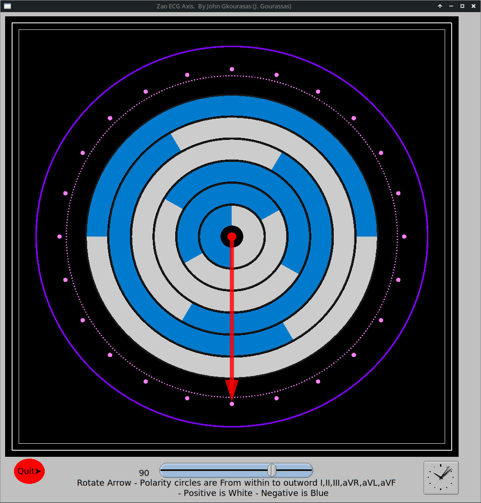

# zao ecg axis

###  This piece of software Is useful to find the electrocardiographic axis of QRS complex from the Frontal leads

### QUICK START: 

    1. First  I recommend to Read - Study  the two articles of Zao. You can find them in Docs dir 

    2. In order to use the circular reference system, one first looks at the
      tracing of the successive limb leads I, II, III, aVR, aVL and aVF, to 
      determine the polarity of a given deflection; i.e. whether the QRS complex 
      is positive, negative or equiphasic. Then, starting with the innermost 
      circle  for lead I (the white semicircle being positive,blue negative, and 
      b o u n d a r y lines being equiphasic) and progressing outwards to leads 
      II, III, aVR, aVL and aVF, one proceeds to match the semicircles with the 
       polarities of the QRS complex previously obtained from the tracing.

    3.  For example, if its polarities in the successive limb leads are 
        pos., pos., pos., neg., equiphasic, pos., then referring to the circular 
         reference s y s t e m gives a direction of + 60. 

### Static Image Arrow - Axis points to  90 degrees
.

**To compile you need:**

OpenGl, Rust, FLTK, fltk-rs 

***For Debian I do:*** 

sudo apt-get install libx11-dev libxext-dev libxft-dev 
libxinerama-dev libxcursor-dev libxrender-dev libxfixes-dev libpango1.0-dev 
libgl1-mesa-dev libglu1-mesa-dev

***To  Run***
'cargo run' or 'cargo bundle' o 'cargo bundle --release'

I have tested on a Linux Intel Machine running Ubuntu and Debian
  And works perfectly well

**Thanks to  MoAlyousef (Mohammed Alyousef) the author of fltk-rs.**

**This work  is a homage to all pioneers of electrocardiography, The ecg_axis was described by Dr Zao n 1952 and 1984**

 J Gkourasas  (Gourassas)  MD Cardiology
 THESSALONIKI GREECE
 jgourassas at gmail dot com

 Enjoy profit!!

